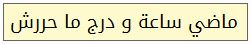
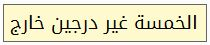
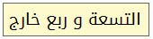
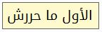

# time-tn : الوقت بالتونسي
L'heure en "Tunisien" genre :

Pour le script Python, l'affichage des lettres en Arabe dans la console Windows reste problématique, il faut déjà changer le code page en ``UTF-8`` avec ``chcp 65001`` mais cela ne fonctionne pas tout le temps. Sous Linux, pas de problème !

L'application Windows utilise la police Google [Noto Kufi Arabic](https://noto-website-2.storage.googleapis.com/pkgs/NotoKufiArabic-hinted.zip)
