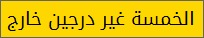

# time-tn : الوقت بالتونسي
La bonne vieille manière de dire l'heure *en Tunisien*

## Script Python
- Linux : il faut que la police *terminal* ou *tty* supporte les caractères Arabes
- Windows : l'affichage des lettres en Arabe dans la console *cmd* ou *powershell* reste problématique, il faut déjà changer le code page en ``UTF-8`` avec ``chcp 65001`` et [trafiquer la base de registres](https://www.howtogeek.com/howto/windows-vista/stupid-geek-tricks-enable-more-fonts-for-the-windows-command-prompt/) pour changer la police de la console. *Cela ne vaut varimant pas la peine !*

## Application Windows
- La bulle est déplaçable avec la souris (bouton gauche)
- Click droit pour sortir du programme
- La police utilisée est la [Noto Kufi Arabic](https://noto-website-2.storage.googleapis.com/pkgs/NotoKufiArabic-hinted.zip)
- Il faut avoir le [.net framework](http://bfy.tw/M9pg) 4.6.1 ou supérieur installé pour utiliser l'exécutable directement
