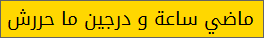

# time-tn : الوقت بالتونسي
L'heure en "Tunisien" genre :

## Script Python
L'affichage des lettres en Arabe dans la console **Windows** reste problématique, il faut déjà changer le code page en ``UTF-8`` avec ``chcp 65001`` et trafiquer la base de registres pour changer la police de la console. Cela ne vaut varimant pas la peine ! Sous **Linux**, pas de problème !

## Application Windows
- La fenêtre est déplaçable avec la souris
- Click droit our sortir du programme
- L'application utilise la police Google [Noto Kufi Arabic](https://noto-website-2.storage.googleapis.com/pkgs/NotoKufiArabic-hinted.zip)
