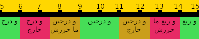

# time-tn : الوقت بالتونسي

La bonne vieille manière de lire l'heure *en Tunisien*

## Introduction
Le [*Tunisien* ou *Derja*](https://fr.wikipedia.org/wiki/Arabe_tunisien) est un mélange d’Arabe, Berbère, Français, Italien, Turc, etc. utilisant l'alphabet Arabe. Les tunisiens ont une manière particulière d’exprimer l’heure. N'ayant trouvé aucune source qui la documente, j'ai initié ce projet. Il présente aussi une implémentation en :
- [Python](https://github.com/wmahfoudh/time-tn/blob/master/python/time-tn.py)
- [C#](https://github.com/wmahfoudh/time-tn/tree/master/c%23) pour Windows
- [Dart](https://github.com/wmahfoudh/time-tn/tree/master/mobile) pour Android/iOS/Web
- [C++](https://github.com/wmahfoudh/time-tn/blob/master/esp8266-clock/tnclock/tnclock.ino) pouvant servir à la réalisation de l'horloge à mots (word clock) **TnClock** à l'aide d'un esp8266...

Vous pouvez voir ce code en action sur le site [clock.tn](https://www.clock.tn/#/) 

## Les règles pour les heures
Chaque heure a un terme spécifique pas forcément celui du nombre qu’elle représente
-	Midi = الأول LAOUEL (traduction = le premier)
-	Minuit = نص الليل NOSS ELLIL (le milieu de la nuit ou minuit)
-	1 heure = ماضي ساعة MADHI SEAA (traduction littérale : le « passé » d’une heure, une heure passée)
-	2 heures = الساعتين ESSEATINE (deux heures)
-	3 heures = ماضي تلاثة MADHI SEAA (le « passé » de trois heures, trois heures passées) ou التلاثة (trois heures)
-	4 heures = الأربعة LARBAA (quatre heures)
-	5 heures = الخمسة EL KHAMSA (cinq heures)
-	6 heures = الستة ESSETTA (six heures)
-	7 heures = السبعة ESSABAA (sept heures)
-	8 heures = الثمنية ETHMANIA (huit heures)
-	9 heures = التسعة ETTESAA (neuf heures)
-	10 heures = العشرة ELACHRA (dix heures)
-	11 heures = الحداش ELAHDECH (onze heures)

A part midi et minuit, l’heure du soir est exprimée de la même manière que l’heure du matin

## Les règles pour les fractions d'heures
Elles ne sont pas exprimées en minutes, l’unité est le **دْرَجْ** ou **DRAJ** qui vaut 5 minutes. *DRAJ* est dérivé de *DRAJA* qui signifie marche (d'escalier)

De 5 à 35 minutes on dit l’heure **h** et on ajoute **و (et)** suivi du nombre de **DRAJ** selon ce qui suit
-	5 minutes = درج DRAJ
-	10 minutes = درجين DARJIN (deux DRAJ)
-	15 minutes = ربع RBO3 ou R'BOA (mot qui veut dire un quart d’heure, c'est une exception à la règle)
-	20 minutes = أربعة ARB3A ou ARBAA (quatre)
-	25 minutes = خمسة KHAMSA (cinq)
-	30 minutes = نص NOSS (mot qui veut dire demi (heure), c'est une autre exception à la règle)
-	35 minutes = سبعة SAB3A ou SABAA (sept)

De 40 à 55 minutes, on dit l’heure **h+1** et on ajoute **غير (moins)** suivi du nombres de **DRAJ** selon ce qui suit
- 40 minutes = أربعة ARBAA (quatre)
- 45 minutes = ربع R'BOA (un quart d’heure, une seconde exception à la règle)
- 50 minutes = درجين DARJIN (deux DRAJ)
- 55 minutes = درج DRAJ

## La touche finale
Pour indiquer le temps avec plus de précision, on ajoute les termes **خارج** KHAREJ (sortant ou qui dépasse) et **ما حررش** MA HARRARCH (pas encore arrivé). A part le bon sens, il n’existe vraimant pas de règle pour utiliser **خارج** et **ما حررش**

Dans l’algorithme proposé, et pour une heure exprimée en unités de 5 minutes (DRAJ)

- entre DRAJ-2:30 m:s et DRAJ-1:00 m:s ما حررش est ajouté
-	entre DRAJ-1:00 m:s et DRAJ+1:00 m:s rien n’est ajouté
-	entre DRAJ+1:00 m:s et DRAJ+2:30 m:s خارج est ajouté

### Exemple

## Script Python
- Linux : il faut que la police *terminal* ou *tty* supporte les caractères Arabes, c'est généralement le cas de toutes les distributions
- Windows : l'affichage des lettres en Arabe dans la console reste problématique, il faut déjà changer le code page en ``UTF-8`` avec ``chcp 65001`` et [modifier la base de registres](https://www.howtogeek.com/howto/windows-vista/stupid-geek-tricks-enable-more-fonts-for-the-windows-command-prompt/) pour changer la police de la console

## Application Windows
- La bulle est déplaçable avec la souris (bouton gauche)
- Click droit pour sortir du programme
- La police utilisée est la [Noto Kufi Arabic](https://noto-website-2.storage.googleapis.com/pkgs/NotoKufiArabic-hinted.zip)
- Il faut avoir le [.net framework](http://bfy.tw/M9pg) 4.6.1 ou supérieur installé

## Application mobile
- Android + iOS in alpha version (please fork and improve!)
- Web (partie de l'application mobile): demo en ligne sur [https://clock.tn/](https://clock.tn/)
